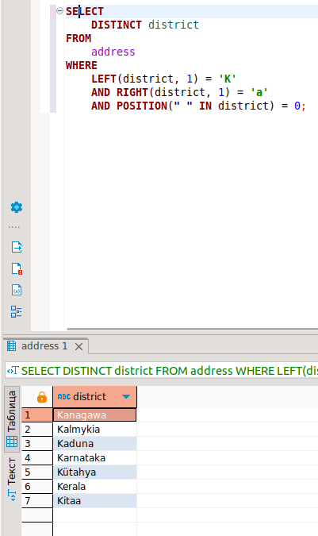
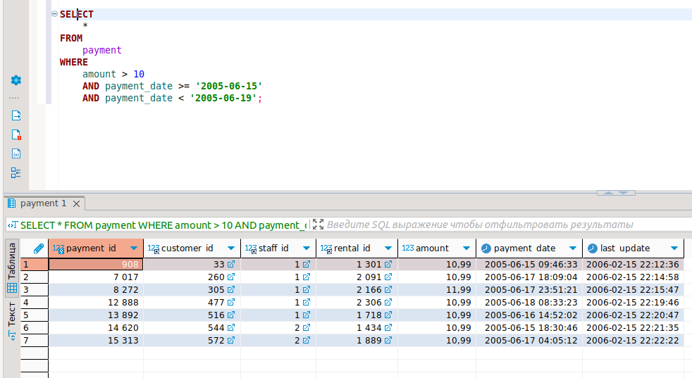
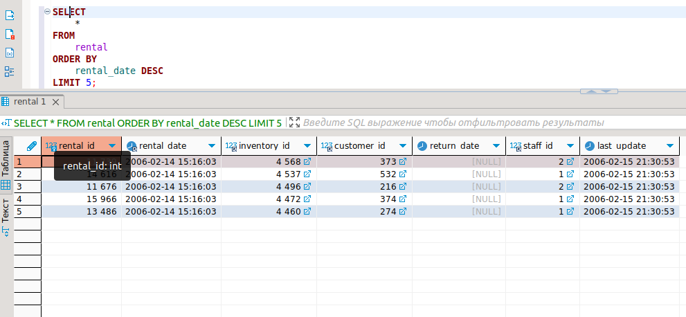
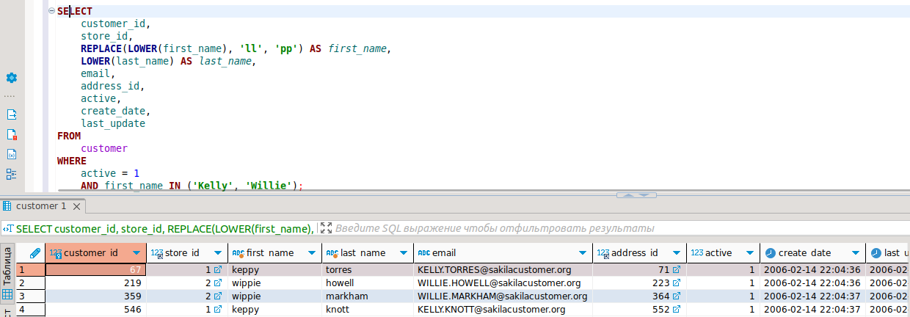
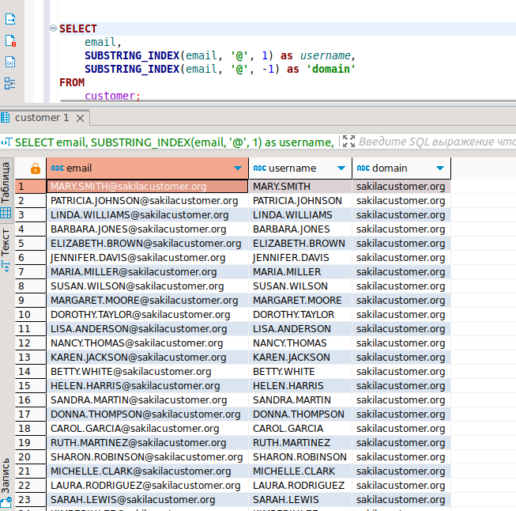

# Домашнее задание к занятию «SQL. Часть 1» "Макарцев Александр Владимирович"

Задание можно выполнить как в любом IDE, так и в командной строке.

### Задание 1

Получите уникальные названия районов из таблицы с адресами, которые начинаются на “K” и заканчиваются на “a” и не содержат пробелов.

#### Решение
```
SELECT
	DISTINCT district
FROM
	address
WHERE
	LEFT(district, 1) = 'K'
	AND RIGHT(district, 1) = 'a'
	AND POSITION(" " IN district) = 0;
```


### Задание 2

Получите из таблицы платежей за прокат фильмов информацию по платежам, которые выполнялись в промежуток с 15 июня 2005 года по 18 июня 2005 года **включительно** и стоимость которых превышает 10.00.

#### Решение
```
SELECT
	*
FROM
	payment
WHERE
	amount > 10
	AND payment_date >= '2005-06-15'
	AND payment_date < '2005-06-19';
```


### Задание 3

Получите последние пять аренд фильмов.

#### Решение
```
SELECT
	*
FROM
	rental
ORDER BY
	rental_date DESC
LIMIT 5;
```


### Задание 4

Одним запросом получите активных покупателей, имена которых Kelly или Willie. 

Сформируйте вывод в результат таким образом:
- все буквы в фамилии и имени из верхнего регистра переведите в нижний регистр,
- замените буквы 'll' в именах на 'pp'.

#### Решение
```
SELECT
	customer_id,
	store_id,
	REPLACE(LOWER(first_name), 'll', 'pp') AS first_name,
	LOWER(last_name) AS last_name,
	email,
	address_id,
	active,
	create_date,
	last_update
FROM
	customer
WHERE
	active = 1
	AND first_name IN ('Kelly', 'Willie');
```


## Дополнительные задания (со звёздочкой*)
Эти задания дополнительные, то есть не обязательные к выполнению, и никак не повлияют на получение вами зачёта по этому домашнему заданию. Вы можете их выполнить, если хотите глубже шире разобраться в материале.

### Задание 5*

Выведите Email каждого покупателя, разделив значение Email на две отдельных колонки: в первой колонке должно быть значение, указанное до @, во второй — значение, указанное после @.

#### Решение
```
SELECT
	email,
	SUBSTRING_INDEX(email, '@', 1) as username,
	SUBSTRING_INDEX(email, '@', -1) as 'domain'
FROM
	customer;
```


### Задание 6*

Доработайте запрос из предыдущего задания, скорректируйте значения в новых колонках: первая буква должна быть заглавной, остальные — строчными.
